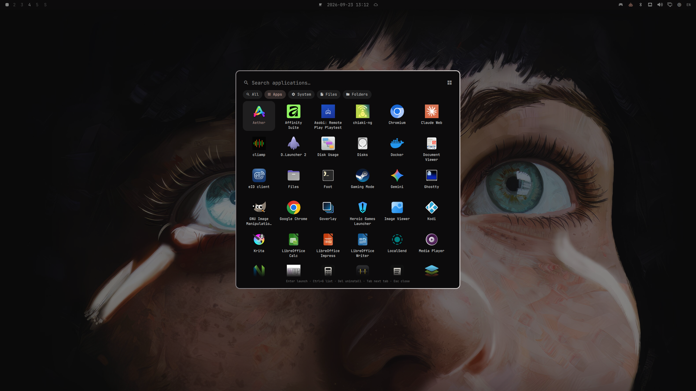
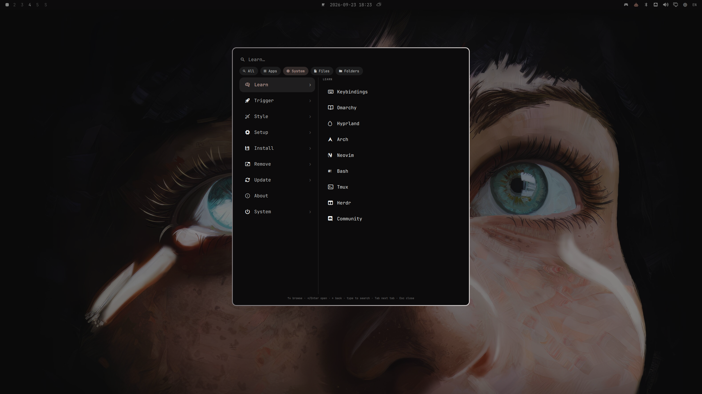
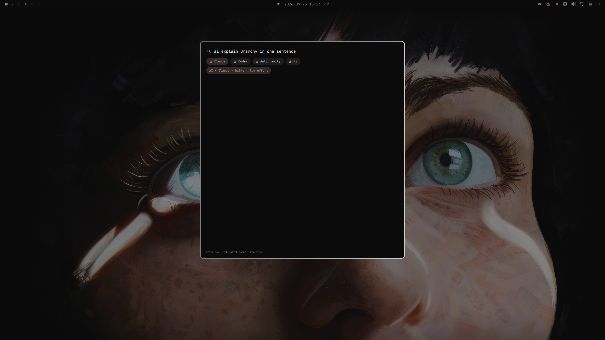

# Omarchy Menu Omni

Built on [basecamp/omarchy](https://github.com/basecamp/omarchy),
[dzhibas/omarchy.dzhibas.menu](https://github.com/dzhibas/omarchy.dzhibas.menu)
and [jesseburlamaque/omarchy-find](https://github.com/jesseburlamaque/omarchy-find).
MIT; attribution and license notices are in [LICENSE](LICENSE).

A unified launcher for Omarchy: applications, system actions, files, folders,
instant answers and AI in one keyboard-driven menu.



https://github.com/user-attachments/assets/51d2cada-dd4d-4596-9a6c-2e71191caf62

[More screenshots](docs/media/README.md) ·
[Built-in answer reference](docs/answers.md)

## Open and navigate

`Super+Space` opens the compact search prompt. Start typing, click a tab, use
Tab / Shift+Tab to cycle, or Ctrl+1…5 to select a visible tab by position.
Switching tabs preserves the query. Arrow keys select a result; Enter activates
it. Esc clears the query, then closes the menu; Left or Backspace on an empty
query goes back a level in System.

| Tab | Contents |
| --- | --- |
| **All** | Answers followed by Apps, System, Files and Folders sections, up to five results per section |
| **Apps** | Installed applications; Ctrl+G switches between list and grid and saves the choice |
| **System** | Omarchy actions in two panes: categories on the left, their items on the right |
| **Files** | File name search under your home directory, with type, sort and result-limit controls |
| **Folders** | Folder search, including a separate System folders filter for configuration directories |

The System tab keeps the category list visible while you browse its items.
Use Up/Down to select, Right or Enter to open, and Left to go back. Typing
searches the menu tree; a query can name the whole path, so `update omarchy`
selects Update › Omarchy. Ctrl+Up/Down jumps between matches. If no system
entry matches, the tab shows instant answers such as the calculator.



`Super+Alt+Space` opens Apps directly. Existing routes such as
`omarchy menu summon style.theme` open the corresponding System submenu.
External select/input prompts (emoji, timezone, keybindings and other dmenu
consumers) retain their plain prompt without launcher tabs.

## Files and folders

| Shortcut | Action |
| --- | --- |
| Enter | Open the selected path with its default application |
| Alt+Enter | Open its containing folder |
| Ctrl+C | Copy the path |
| Ctrl+T | Open a terminal in the folder |
| Ctrl+F | Cycle the type filter |
| Ctrl+S | Cycle the sort order |
| Ctrl+L | Cycle the displayed result limit |

Files filters: All files, Documents, Images, Videos, Audio and Code.
Folders filters: Folders and System folders. Sort by relevance, newest, oldest,
name A–Z or name Z–A; display limits are 15, 30, 60, 100 and 200.

Search uses `fd`, excludes package caches, virtual environments, Git internals
and Steam/Wine traversal noise, and collects up to 500 candidates. It searches
names and paths, not file contents. System folders include browser configuration
roots while skipping their cache and profile internals. All starts file searches
at two characters and skips them when an instant answer already handles the
query. Late results keep the selection on the same item where possible.

## Tab order and visibility

Settings are read on every open from
`$XDG_STATE_HOME/omarchy-menu-omni/state.json`, defaulting to
`~/.local/state/omarchy-menu-omni/state.json`:

```json
{
  "appsView": "grid",
  "tabOrder": ["all", "apps", "system", "files", "folders"],
  "allSections": ["apps", "system", "files", "folders"],
  "disabledTabs": [],
  "allSectionsOff": [],
  "cursorStyle": "block",
  "cursorBlink": true,
  "commandsWithoutSlash": true
}
```

The initial application view is `list`; the example selects `grid`.
`cursorStyle` sets the search cursor: `block` (default), `beam`, `underline`,
`outline` or `none`; `cursorBlink: false` keeps it solid.
`commandsWithoutSlash: false` makes answers (math, conversions, generators,
`shell`, `kill`, `ai`…) work only after `/`; plain text is then purely a search.
`tabOrder` controls visible tab order and the Ctrl+number shortcuts.
`allSections` independently controls the order of result sections in All.
Unknown or duplicate IDs are ignored; omitted IDs are appended in default order.

To hide file and folder search, set `"disabledTabs": ["files", "folders"]`.
Their sections also disappear from All and its file searches stop. To keep the
tabs but leave sections out of All's search, list them in `allSectionsOff`
instead, e.g. `["files", "folders"]`; any section may be off. To open Apps
by default, disable All and put Apps first in `tabOrder`. Disabling every tab
is ignored so the launcher remains usable.

Direct routes remain available: opening Apps or a System submenu temporarily
shows that active tab even when disabled. Switching away hides it again.
Unknown settings are preserved when Ctrl+G saves the view. Invalid JSON is left
untouched; fix its syntax and reopen the menu.

## Bar button and settings

Omni ships an optional bar widget, **Omarchy Menu Omni** (the Omarchy logo).
Add it to the bar with the bar's widget picker, or put
`{ "id": "omarchy-menu-omni" }` first in `bar.layout.left` of
`~/.config/omarchy/shell.json`.

- **Right click** opens the launcher, the same as `Super+Space`.
- **Left click** opens a popup with the System actions. Its **Settings** row
  (Enter or `→`) unfolds every option Omni reads:
  - **Launcher**: apps view, cursor style, cursor blink, answers without `/`.
  - **Tabs**: switch each tab on or off, and change their order.
  - **Search in All**: switch each result section on or off, and change
    their order. A section that is off leaves All only, its tab stays
    (`allSectionsOff` in `state.json`).
  - **Look**: the `style.json` geometry.
  - **AI**: agent, plus the model and effort for that agent.
  - **Settings folder**: opens `~/.local/state/omarchy-menu-omni/`.
- The **System** actions below it are always shown: every action of the
  System submenu (screensaver, lock, suspend, hibernate, logout, reboot,
  shutdown), including your own entries from `omarchy-menu.jsonc`.

Keys in the popup:

| Keys | Action |
| --- | --- |
| `↑`/`↓` | Move |
| `←`/`→` | Change a value or move a tab or section |
| `Enter` | Toggle or run |
| `Esc` | Close |

The mouse works too: the `‹` and `›` arrows change a value, and a click toggles
or runs.

Changes are written to `state.json`, `style.json` and `ai.json`. Other keys in
those files, `_help` included, are kept. The launcher picks the changes up the
next time it opens. A file that is not valid JSON is shown as such and left
untouched.

## Screenshots

[Browse the gallery](docs/media/README.md) for the All search, file results,
System search, calculator and AI agent selector. The demo above shows the All search, Apps grid, the
System tree and its search, file search, calculator, unit conversion and an AI
answer.

## Instant answers

| Example | Result |
| --- | --- |
| `sqrt(144)+2^8` | Calculator: 268 |
| `100 km to miles` | Unit conversion |
| `20 c to f` | Temperature conversion |
| `123 eur to usd` | Currency conversion with rate date |
| `time in tokyo` | Local time and offset |
| `uuid`, `password 24`, `epoch` | Generated values; Ctrl+R refreshes them |
| `sha256 omarchy`, `base64 hello` | Developer utilities |
| `github.com/basecamp/omarchy` | Open a URL |
| `kill chromium` | Matching processes; Enter sends SIGTERM |
| `shell ping sme.sk` | Enter runs the command in a new terminal, which stays open afterwards |

Start a query with `/` for answers only: `/2+3`, `/100 km to miles`,
`/password`, `/shell ls` or `/ai …` show just the answer, without apps, files
or menu entries around it, and the tabs are hidden. A lone `/` lists one
example per command as a read-only hint; typing narrows the hints to the
commands that still fit (`/pa` → `/password 24`) and they give way to the
answer once it is unambiguous. Without the slash
the same text is a normal search with any answer on top.

Unmatched text offers web search. Chromium-family browsers use their configured
search engine; Firefox uses the fallback template (DuckDuckGo by default).
Calculator and unit conversions work locally. Currency queries fetch and cache
rates only when used. See [all syntax and limitations](docs/answers.md).

## AI answers

Type `ai <question>` and press Enter to submit. The answer streams into the
menu; Ctrl+C copies it, arrow/Page keys scroll, and Esc cancels or closes.
After an answer is ready, Enter continues the conversation in a terminal.
Typing alone sends no request.



In AI mode the tab bar lists the installed agents instead of the tabs
(Claude, Codex, Pi, Antigravity — whichever CLIs are on `PATH`). One is always
preselected, so Enter asks straight away; Tab / Shift+Tab or Ctrl+1…n switches
agent, handy when one has run out of usage. Switching cancels a running
answer, and the last pick is remembered in `state.json` as `aiAgent`.

Before anything has been picked (or if the remembered agent is uninstalled),
the preselected agent is `~/.config/omarchy/defaults/agent`, else the first
installed one.

Per-agent settings live in `~/.local/state/omarchy-menu-omni/ai.json`, next to
`state.json`:

```json
{
  "models": {"claude": "haiku", "codex": "gpt-6-luna", "pi": "openai-codex/gpt-6-luna", "agy": "gemini-3.8-flash-low"},
  "efforts": {"claude": "low", "codex": "low", "pi": "low", "agy": "low"}
}
```

By default every agent runs on the model and effort its own CLI is configured
with; the plugin picks nothing. `models` and `efforts` (both optional) set a
model or reasoning effort per agent for launcher questions — for example a
cheap, fast model as above. Continuing in the terminal resumes on the CLI's own
model.

For compatibility with omarchy-find's `ai.json`, two older keys still work: an
`"agent"` overrides the Omarchy default for the first-run preselection only
(a remembered pick always wins), and a top-level `"model"` pins that agent's
model, including in the terminal continuation. `models` covers both needs.

Install and authenticate the chosen CLI separately.

| Agent | Restrictions during the menu request |
| --- | --- |
| Claude | WebSearch and WebFetch only, strict empty MCP configuration, restricted mode |
| Codex | Read-only sandbox |
| Pi | No tools |
| Antigravity (agy) | Plan mode (answers without acting) and `--sandbox` |
| OpenCode | Headless requests disabled because tool removal cannot be enforced by this adapter |

The terminal continuation uses your ordinary interactive permissions. Markdown
images render as links, raw HTML is escaped, and only clicked HTTP(S) links open.
The adapter implementation and tests are in `ai/` and `tests/ai_unit_test.js`.

## Installation and integration

Requires **Omarchy Quattro** with its Quickshell plugin API.

### Install

The [Omarchy plugin marketplace](https://plugins.omarchy.org) uses the standard
Omarchy Git installer:

```bash
omarchy plugin add https://github.com/filip-spaldon/omarchy-menu.git --enable
```

The installer validates the plugin, places it in
`~/.config/omarchy/plugins/omarchy-menu-omni`, and enables it. Enabling Omni
replaces the stock menu while keeping existing `Super+Space`, `Super+Alt+Space`
and `omarchy menu` routes. It also provides an optional bar button, see
[Bar button and settings](#bar-button-and-settings). Verify with:

```bash
omarchy menu ping
omarchy menu summon
```

Custom system actions still come from
`~/.config/omarchy/extensions/omarchy-menu.jsonc`.

### Update, disable and remove

```bash
omarchy plugin update omarchy-menu-omni
omarchy plugin disable omarchy-menu-omni
omarchy plugin enable omarchy-menu-omni
omarchy plugin remove omarchy-menu-omni
```

Run the command for the action you need. Disabling or removing Omni restores
the stock menu when it was active before Omni was enabled. To explicitly select
the stock menu, run `omarchy plugin enable omarchy.menu`.

Removal deletes the plugin checkout. Preferences and `ai.json` under
`~/.local/state/omarchy-menu-omni/` and the currency cache are retained.

### Dependencies and runtime behavior

Omni uses the existing Omarchy shell and its menu, browser and application
helpers. File search requires `fd`; clipboard actions use `wl-copy` / `wl-paste`
(`wl-clipboard`); opening paths uses `gio` (`glib2`); terminals use
`xdg-terminal-exec`. Other helpers are Bash, GNU coreutils, `ps` (`procps-ng`),
`timedatectl` (`systemd`), `curl`, `jq`, `gtk-launch` and `uwsm-app`. These are
normally provided by Omarchy. AI additionally needs a supported agent CLI and
its authentication; see [AI answers](#ai-answers).

There is no custom installer, remote build or additional service. The plugin
runs inside the existing shell with your user permissions. It reads menu
configuration, installed applications and file names beneath your home directory;
preferences and cached exchange rates are written to the paths documented above.
Currency queries access the rate service, AI submission starts the chosen agent,
and opening a URL or web search launches your browser. System actions retain the
usual Omarchy behavior, including permission prompts where required.

### Existing local installations

When migrating from `filippaldo.menu`, close the menu, rename the plugin directory,
replace its ID in `shell.json` (including `cloneSourceRestores`), and move the old
state directory to `omarchy-menu-omni` under the same state root. Keep existing
settings; an `ai.json` from the old plugin directory moves to the state
directory too. Rescan plugins after the move.

## Appearance and development

The card follows the active Omarchy theme. Its size lives in
`~/.local/state/omarchy-menu-omni/style.json`, created on first open with the
defaults and re-read every time the menu opens:

```json
{
  "fontScale": 1,
  "cardWidth": 560,
  "bodyHeight": 0.6,
  "fixedHeight": false,
  "top": 0.2,
  "pickerHeight": 0.7
}
```

The defaults keep the stock menu's full-size text and a results area that fits
its rows, but are wide enough for the tabs to sit on one line and pinned near
the top so the card grows downward. The stock menu itself is
`{"cardWidth": 300, "bodyHeight": 0.7, "top": "center"}`.

| Key | Default | Purpose |
| --- | --- | --- |
| `fontScale` | `1` | Text and icon scaling (0.5–2) |
| `cardWidth` | `560` | Width in `Style.space()` units (200–2000); chips wrap when narrow |
| `bodyHeight` | `0.6` | Results area as a share of the screen height |
| `fixedHeight` | `false` | `false` fits the rows; `true` keeps one size while typing and switching tabs |
| `top` | `0.2` | `"center"`, or the top edge as a share of the screen |
| `pickerHeight` | `0.7` | Maximum list height of dmenu pickers |

Missing or out-of-range values fall back to the defaults above. Some combinations
to try:

| Look | fontScale | cardWidth | bodyHeight | fixedHeight | top |
| --- | --- | --- | --- | --- | --- |
| Compact | 0.8 | 540 | 0.35 | true | 0.22 |
| Spotlight | 0.9 | 720 | 0.40 | true | 0.15 |
| Dense | 0.75 | 680 | 0.55 | true | 0.12 |
| Comfortable | 1.0 | 640 | 0.38 | true | 0.20 |

The empty All prompt is always compact. Source edits usually reload
automatically; after adding or renaming a file run `omarchy restart shell`.

### Code layout

| File | Role |
| --- | --- |
| `Menu.qml` | Entry point: tabs, routing, row model, keys and the card's layout |
| `AnswerEngine.qml` | Instant answers (calculator, conversions, time, generators, kill, URL, shell, web search) and the data they fetch |
| `FileSearchController.qml` | Files/Folders search: `fd`/`stat` processes, results and ranking into rows |
| `AiController.qml` | AI mode: config, agent discovery and switching, generation processes, terminal handoff |
| `SettingsStore.qml` | Loads, validates and saves `state.json` and `style.json` |
| `BarWidget.qml` | Bar button: left click shows the settings popup and System actions, right click opens the launcher |
| `AiPanel.qml`, `ResultRow.qml`, `SystemCategoryItem.qml`, `AppGrid.qml`, `TabBar.qml` | Visual pieces of the card |
| `MenuModel.js`, `Tabs.js`, `FileSearch.js`, `Settings.js`, `ai/*.js` | Pure logic, tested with Node |

The controllers own no UI and reach the menu only through their `menu`
property.

```bash
node tests/menu_unit_test.js
node tests/ai_unit_test.js
```

[Development and integration notes](docs/development.md) describe the inherited
menu behavior, application fallback and test boundaries.
