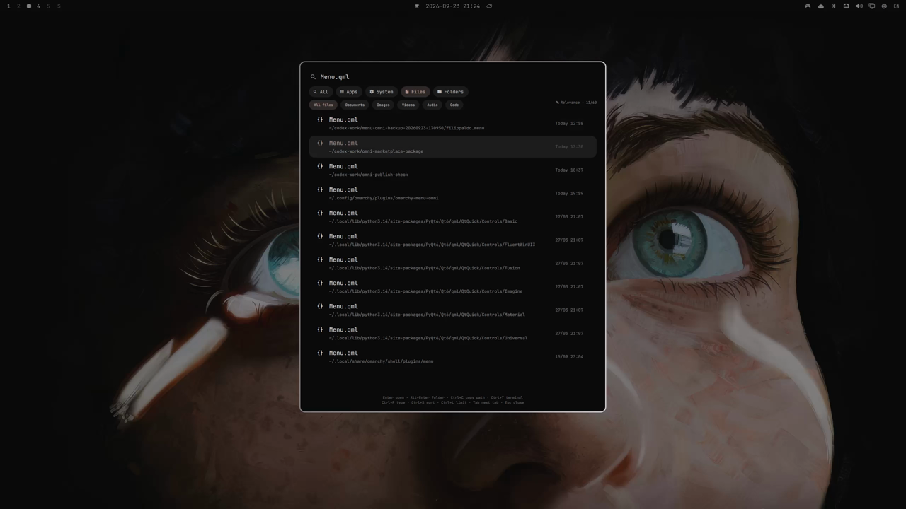
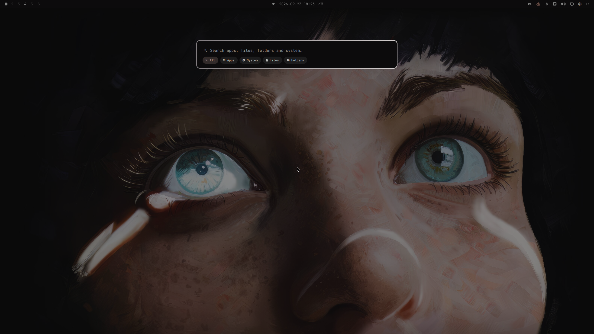
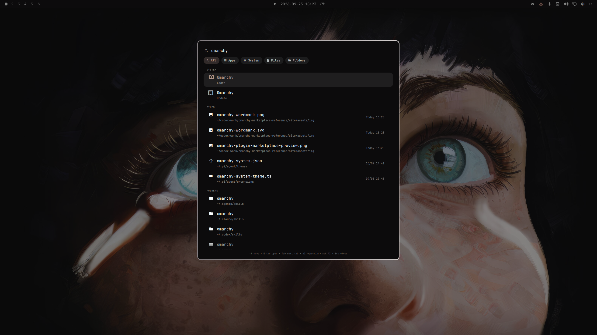
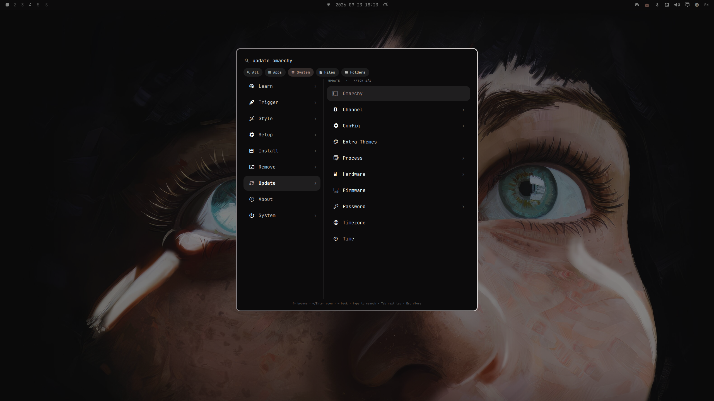
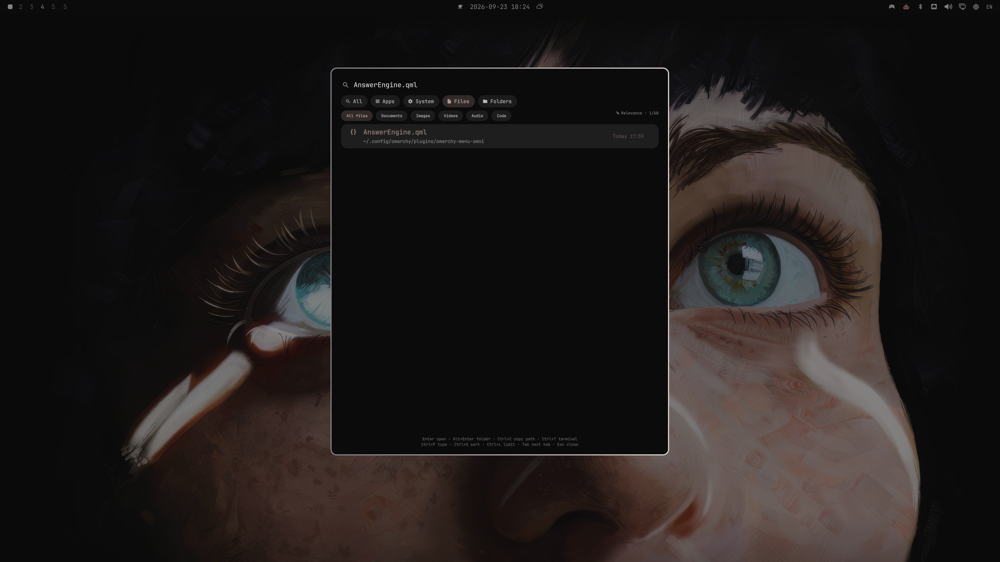
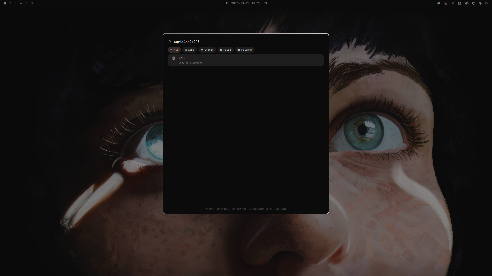

# Menu gallery

The recording ([demo.mp4](demo.mp4), 51 s) shows the All search, Apps grid, the System tree and its search, file search, calculator, unit conversion and an AI answer.

## Compact launcher

## Applications

## All search

## System actions

## System search

## File search

## Calculator

## AI agent selector

